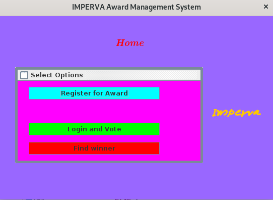
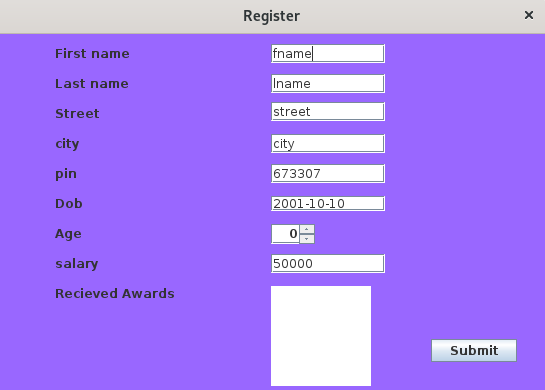
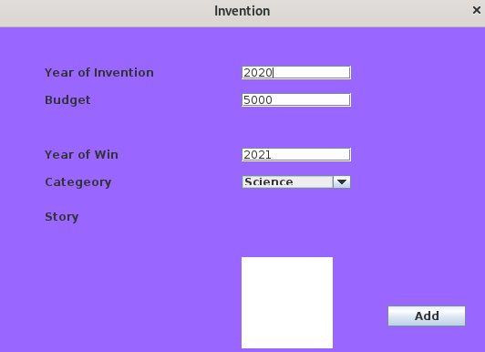
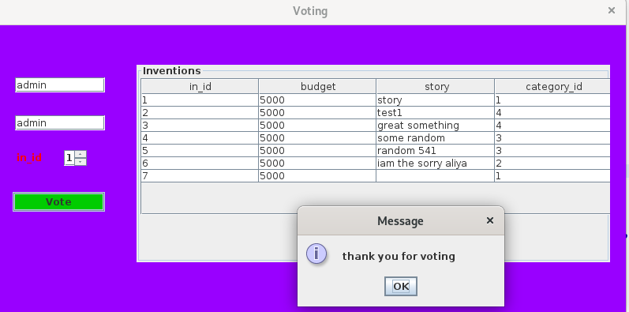
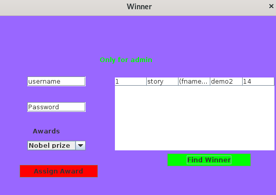

# Award_Management_

official repo for java - DBMS project s3 

## Java_Source

### Project tree

Award_Management
 * [bin](Award_Management/bin)
   * [award_m](Award_Management/bin/award_m)
     * [Database.class](Award_Management/bin/award_m/Database.class)
     * [Register.class](Award_Management/bin/award_m/Register.class)
     * [Vote.class](Award_Management/bin/award_m/Vote.class)
     * [voting.class](Award_Management/bin/award_m/voting.class)
     * [winner.class](Award_Management/bin/award_m/winner.class)
     * [update_winner.class](Award_Management/bin/award_m/update_winner.class)
   * [Gui](Award_Management/bin/Gui)
   * [Voting$1.class](Award_Management/bin/Gui/Voting$1.class)
   * [Voting$2.class](Award_Management/bin/Gui/Voting$2.class)
   * [Voting.class](Award_Management/bin/Gui/Voting.class)
   * [Registration$1.class](Award_Management/bin/Gui/Registration$1.class)
   * [Registration$2$1.class](Award_Management/bin/Gui/Registration$2$1.class)
   * [Registration$2.class](Award_Management/bin/Gui/Registration$2.class)
   * [Registration.class](Award_Management/bin/Gui/Registration.class)
   * [Winner$1.class](Award_Management/bin/Gui/Winner$1.class)
   * [Winner$2.class](Award_Management/bin/Gui/Winner$2.class)
   * [Winner$3.class](Award_Management/bin/Gui/Winner$3.class)
   * [Winner.class](Award_Management/bin/Gui/Winner.class)
 * [src](Award_Management/src)
     * [Gui](Award_Management/src/Gui)
       * [Voting.java](Award_Management/src/Gui/Voting.java)
       * [Registration.java](Award_Management/src/Gui/Registration.java)
       * [Winner.java](Award_Management/src/Gui/Winner.java)
     * [award_m](Award_Management/src/award_m)
         * [Database.class](Award_Management/src/award_m/Database.class)
         * [Register.java](Award_Management/src/award_m/Register.java)
         * [Database.java](Award_Management/src/award_m/Database.java)
         * [Vote.java](Award_Management/src/award_m/Vote.java)
         * [voting.java](Award_Management/src/award_m/voting.java)
         * [winner.java](Award_Management/src/award_m/winner.java)
         * [update_winner.java](Award_Management/src/award_m/update_winner.java)
      
### External Library
```
r2xml

psql JDBC Driver
```

### Gui

Home



Register





Voting



Winner



Update Winner


